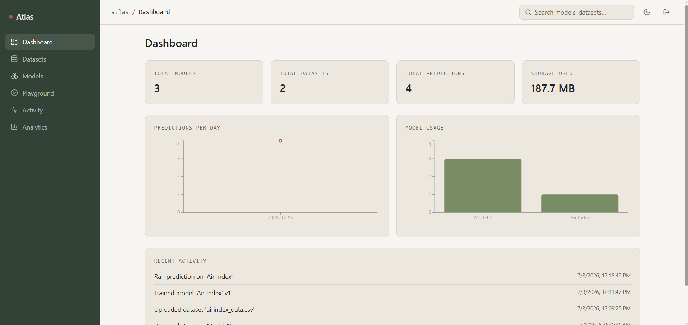
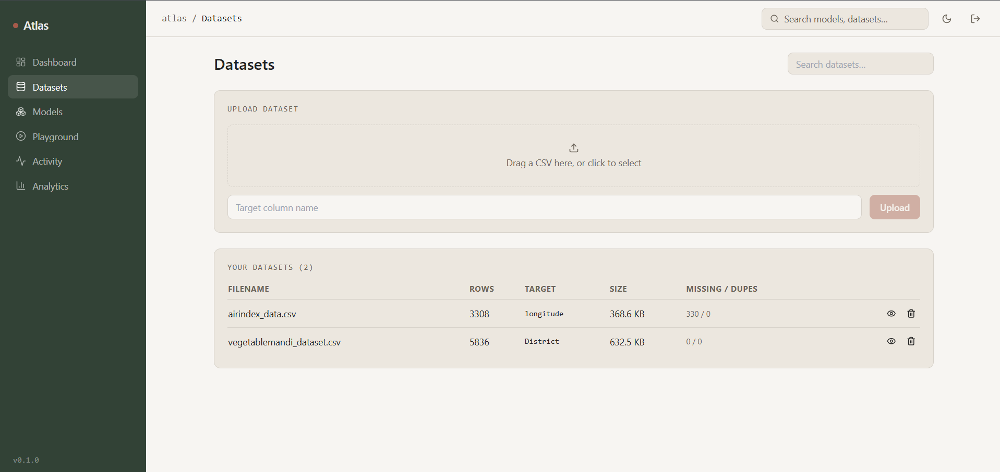
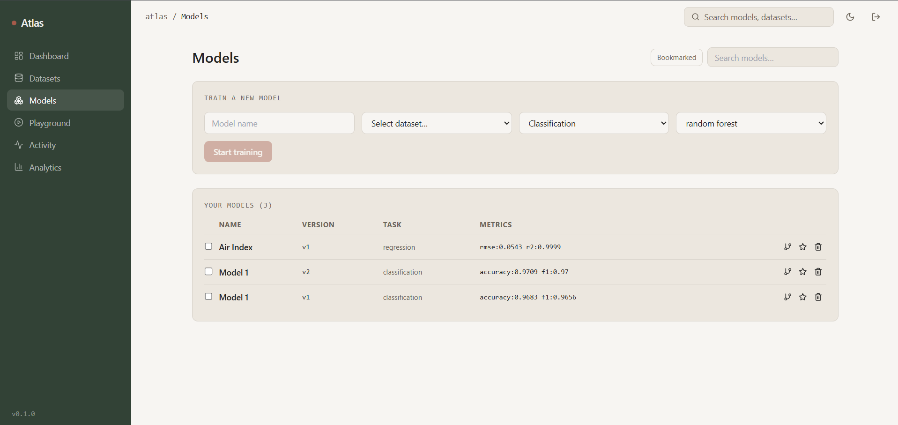
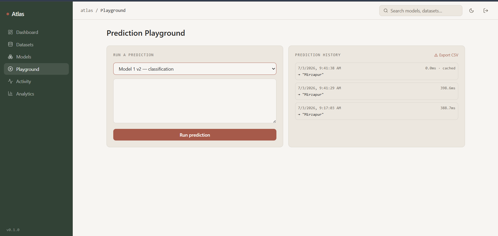
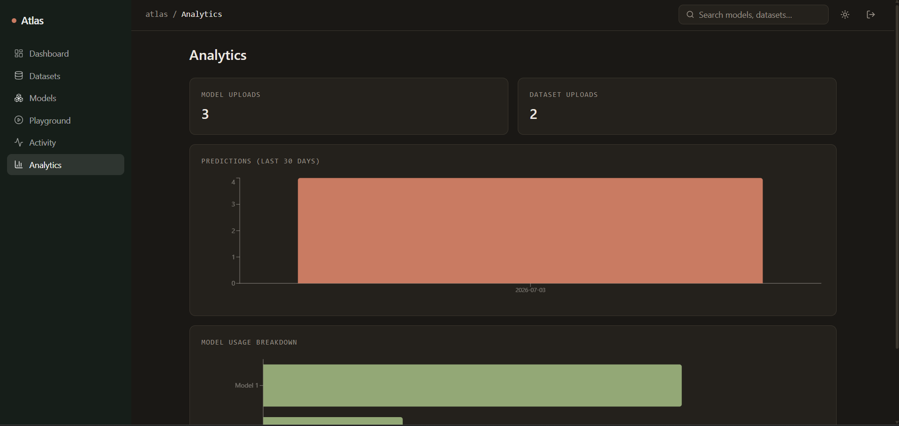

# Atlas

A full-stack platform for uploading datasets, training ML models, testing predictions, and monitoring everything through a live dashboard — built as a placement portfolio project demonstrating full-stack engineering, REST API design, relational database design, and applied data structures & algorithms.

**Live app:** [atlas-kappa-sooty.vercel.app](https://atlas-kappa-sooty.vercel.app/)
**Backend API docs:** [atlas-backend-ijck.onrender.com/docs](https://atlas-backend-ijck.onrender.com/docs)

> Note: the backend is hosted on Render's free tier, which sleeps after 15 minutes of inactivity. The first request after idle time may take 30–50 seconds to respond while it wakes up — this is expected, not a bug.

---

## Screenshots

<!-- Paste your screenshots below. Example markdown for adding an image: -->
<!--  -->

### Dashboard
<!--  -->


### Dataset Manager
<!--  -->


### Model Manager
<!--  -->


### Prediction Playground
<!--  -->


### Dark mode
<!--  -->


---

## Features

**Authentication** — JWT-based register/login, profile management.

**Dataset Manager** — drag-and-drop CSV upload, automatic schema inference, missing-value and duplicate-row detection at upload time, dataset preview, search, pagination, delete.

**Model Manager** — train classification or regression models (Random Forest, Logistic Regression, Linear Regression) on any uploaded dataset. Automatic version chaining (retraining under the same name creates v2, v3, …), version history view, side-by-side model comparison, bookmarking, tags/description editing, delete.

**Prediction Playground** — send a JSON payload to any trained model and get back a prediction, confidence score, and inference latency. Full prediction history per model, exportable as CSV.

**Activity Timeline** — a running log of every upload, training run, prediction, and profile change.

**Analytics Dashboard** — total models/datasets/predictions, storage used, predictions-per-day chart, model usage breakdown — all computed with live SQL aggregation queries.

**Global Search** — type in the top bar to get live autocomplete suggestions across models and datasets.

**UI** — light/dark mode, sidebar + topbar + breadcrumb layout inspired by Linear/Notion/GitHub, custom warm-neutral design system (no default Tailwind palette, no gradients/glassmorphism).

---

## Tech stack

**Frontend:** Next.js 14 (App Router), React, TypeScript, Tailwind CSS, React Query, Framer Motion, Recharts, next-themes

**Backend:** FastAPI, SQLAlchemy, PostgreSQL, Pydantic, JWT auth (python-jose + passlib), scikit-learn, pandas

**Deployment:** Vercel (frontend), Render (backend), Neon (managed PostgreSQL)

---

## Data structures implemented (not just referenced — actually used in the request path)

| Component | Structure | Why this over the naive approach |
|---|---|---|
| Training job scheduler (`job_queue.py`) | Min-heap priority queue | O(log n) insert/pop so higher-priority jobs always run first, instead of an O(n) scan over a list every time a job is picked up |
| Prediction cache (`lru_cache.py`) | OrderedDict-based LRU cache | O(1) get/put; avoids recomputing inference for repeated identical inputs, with a `/cache/stats` endpoint exposing real hit-rate numbers |
| Rate limiter (`rate_limiter.py`) | Deque-based sliding window | O(1) amortized per request; avoids the 2x burst-at-boundary problem inherent to fixed-window rate limiting |
| Global search (`search_trie.py`) | Trie (prefix tree) | O(k) prefix lookup (k = query length), independent of how many models/datasets exist — a SQL `LIKE '%query%'` can't use an index and degrades to a full table scan as the catalog grows |
| Analytics (`dashboard.py`, `models_routes.py`) | SQL `GROUP BY` + aggregate functions | A single query computes avg/min/max latency, cache hit rate, and per-day counts instead of looping over rows in application code |

---

## Database schema

Normalized PostgreSQL schema with foreign keys, indexes, and cascading deletes:

```
users
  ├── datasets (owner_id FK)
  │     └── training_jobs (dataset_id FK)
  ├── models (owner_id FK, training_job_id FK, parent_model_id FK → self, for version chains)
  │     └── prediction_logs (model_id FK)
  └── activity_logs (user_id FK)
```

Indexes are placed on the columns actually queried against in hot paths — `(owner_id, created_at)` on datasets/models for the paginated list views, `(model_id, created_at)` on prediction_logs for history lookups.

---

## Architecture

```
atlas/
  backend/
    app/
      api/          route handlers — auth, datasets, training, predictions,
                     models_routes, activity, search, dashboard
      core/         config (pydantic-settings) + JWT auth dependency
      db/           SQLAlchemy session/engine setup
      models/       ORM models — the normalized schema above
      services/     job_queue, lru_cache, rate_limiter, search_trie,
                     ml_service (train/predict), activity (logging helper)
      main.py       FastAPI app, CORS, router registration, lifespan (starts
                     the background training worker + builds the search trie)
    requirements.txt
    runtime.txt      pins Python 3.11 for deployment compatibility

  frontend/
    app/
      page.tsx              dashboard
      datasets/page.tsx
      models/page.tsx
      predict/page.tsx
      activity/page.tsx
      analytics/page.tsx
      globals.css            light/dark CSS custom properties
    components/
      layout/                Sidebar, Topbar (search + theme toggle), DashboardShell
      ui/Card.tsx
      AuthGate.tsx / AuthedLayout.tsx
      ThemeProvider.tsx / QueryProvider.tsx
    lib/api.ts                typed API client covering every backend endpoint
```

---

## Running locally

### Prerequisites
- Python 3.11+
- Node.js 18+
- A PostgreSQL database (a free [Neon](https://neon.tech) project works well)

### Backend

```bash
cd backend
python -m venv venv
source venv/bin/activate        # Windows: venv\Scripts\activate
pip install -r requirements.txt

cp .env.example .env
# edit .env with your DATABASE_URL and a SECRET_KEY

uvicorn app.main:app --reload --port 8000
```

Visit `http://localhost:8000/docs` to confirm it's running.

### Frontend

```bash
cd frontend
npm install
cp .env.local.example .env.local
npm run dev
```

Visit the local URL it prints (usually `http://localhost:3000`).

---

## Deployment notes

- **Backend (Render):** root directory `backend`, build command `pip install -r requirements.txt`, start command `uvicorn app.main:app --host 0.0.0.0 --port $PORT`. Python version pinned via `PYTHON_VERSION=3.11.9` environment variable (Render's default Python version doesn't yet have prebuilt wheels for some dependencies).
- **Frontend (Vercel):** root directory `frontend`, environment variable `NEXT_PUBLIC_API_URL` pointing at the Render backend URL.
- **Database (Neon):** managed PostgreSQL, connection string passed via `DATABASE_URL`.

---

## Known limitations

These are intentional scope decisions, documented here rather than discovered by accident:

- **No forgot-password flow or OAuth** — both require external email/OAuth provider infrastructure with limited additional signal for a portfolio project relative to the setup cost.
- **In-memory job queue, cache, and rate limiter** — appropriate for a single-process deployment; a production version at scale would move these to Redis + Celery.
- **CSV datasets only** — no image/video/audio support, to keep the ML pipeline fully explainable end to end.
- **Categorical features are one-hot encoded naively** at training time; unseen categories at inference time are zero-filled rather than causing an error.

---

## Roadmap

- [ ] Feature-importance / explainability view per model
- [ ] Docker + docker-compose for one-command local setup
- [ ] Swap in-process job queue for Celery + Redis
- [ ] Support additional frameworks (XGBoost, LightGBM)

## Author

**Angad Devgan**  
Final Year CSE Student — CCET Chandigarh  
[GitHub](https://github.com/angadevgan) · [LinkedIn](https://linkedin.com/in/angad-devgan)

---

## License

MIT License — feel free to use this project as a reference.
